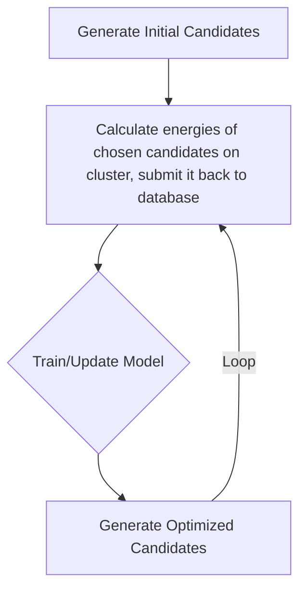

# AI-Driven Catalyst Discovery Pipeline

An integrated workflow for AI-assisted catalyst discovery combining:
- Molecular structure generation
- Structural corresponding activation energy prediction
- Machine learning optimization
- Interactive GUI management

## Key Features
- **SMILES Generator**: Recursive structure generation with valence-aware chemistry rules
- **ML Optimization**: Reinforcement learning-guided candidate selection
- **Database Management**: SQLite storage with energy validation and visualization
- **Dual GUIs**: Separate interfaces for discovery workflow and database management
- **Energy Prediction**: Multi-output regression model for catalyst properties
- **Loose Coupling**: Any component can be easily replaced if a better algorithm is employed

## Workflow Overview

## How to use it and QA
GUIs have been provided to use the predictor. Run `main_gui.py` and follow the steps to use it. But here are some possibles questions and their solutions:
 - Why I see error messages about no training data and generation failed the first time I run the program? 
   Solution: The database needs to be initialized manually if there's no entry in it. Run `add_dummy_data.py` to intialize the database, this dummy data can be deleted later by running `database_manager.py`
   
 - Why no structure is generated when I click the `Generate Candidates` button?  
   Solution: Maybe the Max-allowed difference boundary you set is too strict, and based on the current database, the computer doesn't think any structure can have energies within the given boundary.
   Try a loose boundary. And the model will always try to give you the structure with the smallest activation energy.

 - How do I modify setting about the generator, for example I want predictions favor smaller rings and heterocycles?  
   Solution: In `smiles_generator.py` all parameters about generating structures are stored in the initialization method. All the parameters can be changed freely within a reasonable range.
   The default setting favors commonly seen functional groups and structures.

 - What's the unit for the energy input?  
   Answer: There's no strict restriction on the unit of the input as long as it's consistent. It's suggested to manually convert units to kcal/mol or kJ/mol
